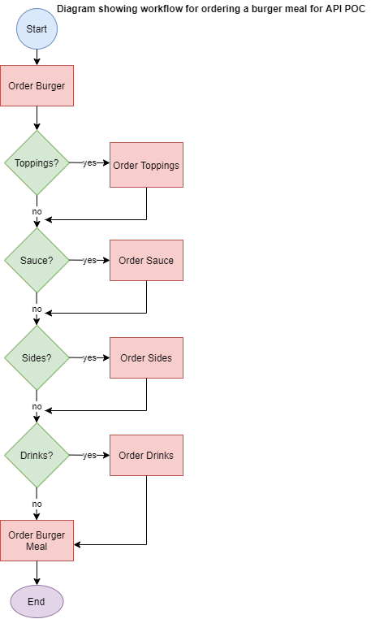

This documentation is borrowed and adapted from [Alex Fielder](https://www.linkedin.com/feed/update/urn:li:activity:6626465471241732096/). For training purposes only.

# API Documentation for Restaurant Orders

## Introduction 

The overall concept for this embryo API is to take restaurant orders from seated customers, send the orders to the kitchen for preparation, and generate a bill at the end of the sitting. The system will be used by: table staff, duty manager, and kitchen staff. The Proof of Concept (POC) at this stage is for a restaurant API for taking food orders, sending the orders to the kitchen, and generating bills. The API takes orders from the restaurant-side by the waiter/waitress and sends the order to the server-side ordering terminal in the kitchen. The orders are printed out for the cooks.

The next stage of the API development will be to develop a tablet-based ordering system for take-away orders. Customers will use a tablet to place orders. The orders will generate a bill which the customer pays. The order is then sent to the kitchen for preparation.

### Burger Meal Order Workflow

## POST RESPONSES 

Possible server responses to POSTS. 

*__Table showing possible server responses to POSTS (status and descriptions)__* 

| STATUS | CODE DESCRIPTION                                            |
|--------|-------------------------------------------------------------|
| 200    | Meal was successfully ordered.                              |
| 400    | Error in order. Data missing or incomplete. Please reorder. |
| 500    | Internal server error. Please try again.                    |

## Additional Topics

[POST Bugermeal Properties File](POST-Properties-Reference.md) Properties and descriptions for POST actions.

[GET Properties File](GET-Properties-Reference.md) Properties and descriptions for GET actions (get bill).

[WORKFLOW Diagram](AaronAPIWorkflow.png) Workflow diagram for burgermeal order.
